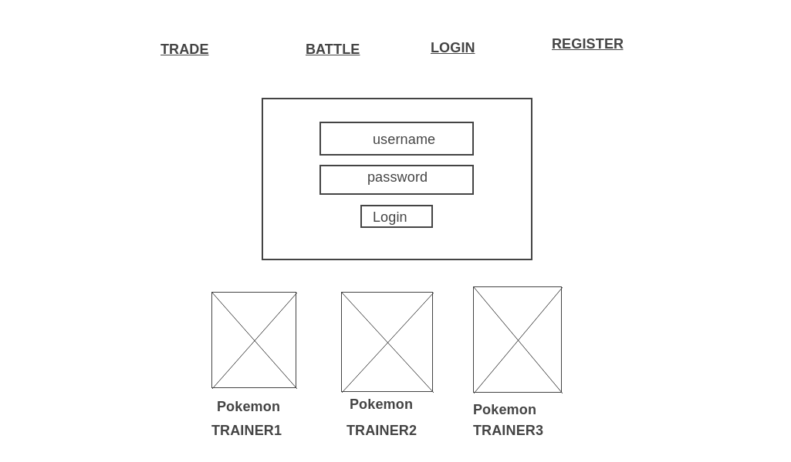
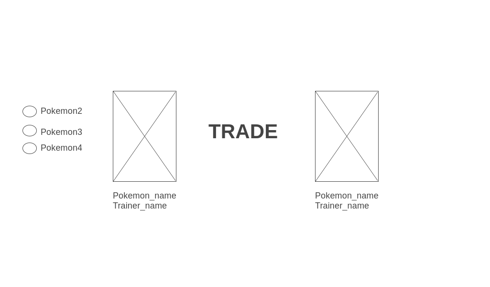
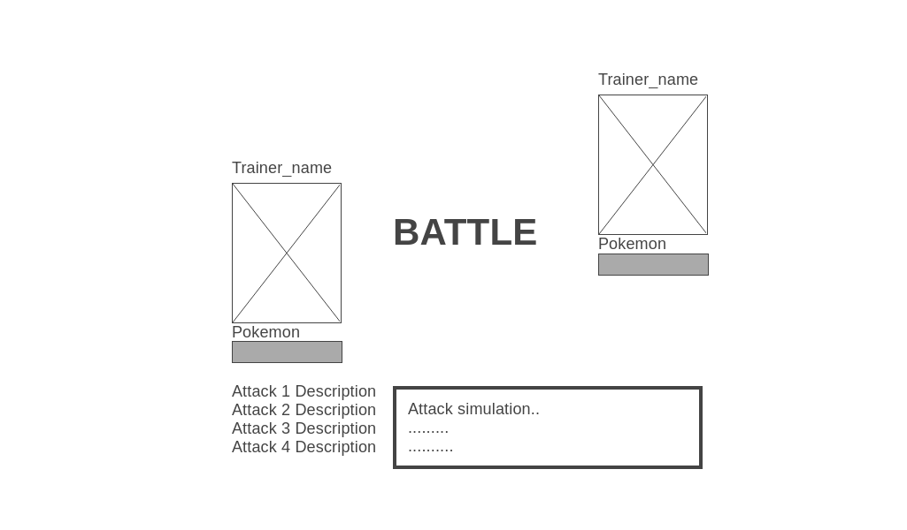
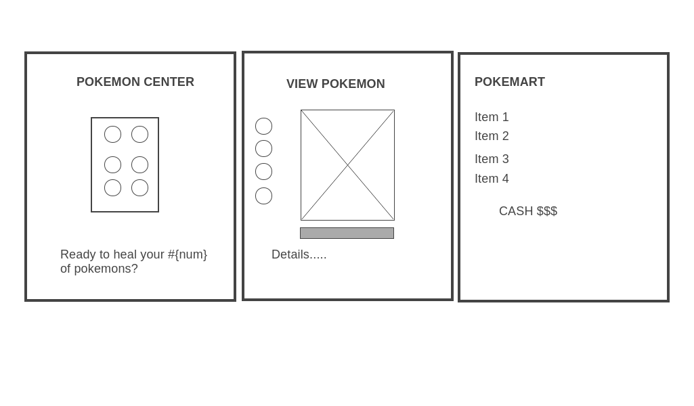
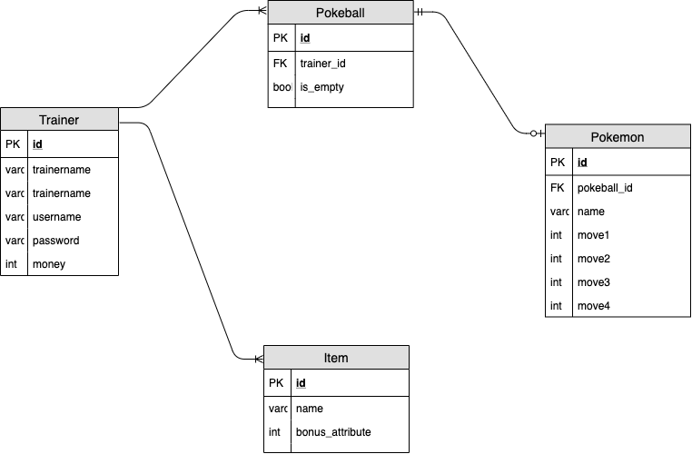

Pokemon

Overview:

This is a pokemon battle and trading game where user will be a pokemon trainer. At the very start of the game the user is asked to login if he already have an account if not he is asked to register. While not logged in, the user can freely view trainers that wants to trade their pokemon with other trainers pokemon. When logged in the user becomes a pokemon trainer, he has the access to view his pokemons, battle or capture a pokemon, access to a pokemon center and trainer can send his beloved pokemon to a trading block where he can swap it with other players pokemon.

    Features:
    - Trading ones pokemon to other logged in user/trainer.
    - 1v1 Battle with other user/trainer.
    - Battling with pokemon in the wild with the option to add that pokemon to the user if he manages to capture it using a pokeball.

    Goals:
    - My goal is to make the game functional where each user will feel secured with their account by providing them username, password, and trainer name. 
    - To further master manipulating the pokeapi to be set up at the game server. 
    - To figure out the battle system of the game and and the function of capturing and adding new pokemon from the wild to the user/trainer inventory.
    - Finally to implement user to user interaction via battle and trading system that can be seen even if logged out but can be joined if logged in.

    Challenges:
    - Authentication using JWT has been my kryptonite for the entire unit 3 and 4 so hoping to be immune from that after this project.
    - Trading and battling will be a challenge since it involves other user.

MVP:
  - Adding of pokeball with the pokemon inside it to the user's database is a must.
  - Interacting with other user via trading and battling is gonna be my highest MVP. 

  CLIENT:
  
  - This is the login page, register page would look similar for this one too.

  
  - This is the trading of 2 trainers will look like once logged in. If user is not logged in he can still see other users pokemon that are ready to be traded but he can not participate to it.

  
  - This is the battle system in the game. UI with user vs user is also the same as user vs npc but in NPC there is an option to throw a pokeball.

  
  - Pokemon center is one of the navigation that would heal all users pokemon, view pokemon where in it will be an option to put user/trainer pokemon into either trading or battle and finally item shop to buy pokeballs and potions.

SERVER:
ERD

API
 - https://pokeapi.co/api/v2/pokemon/
 - https://pokeapi.co/api/v2/berry/
 - https://pokeapi.co/api/v2/move/
  